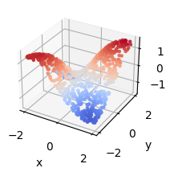
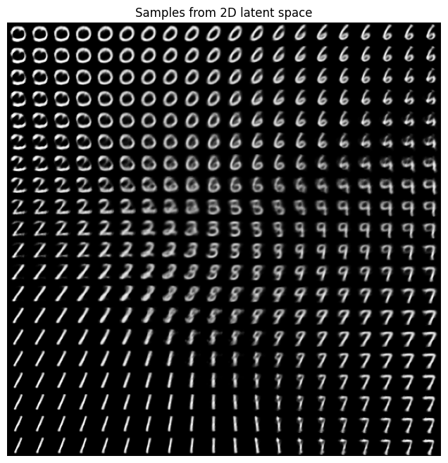
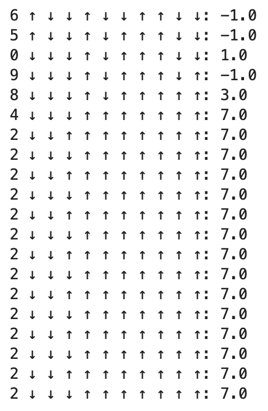

# Lecture Notes on Neural Networks and Machine Learning for Mathematicians and Physicists

[Lecture Notes](LectureNotes.pdf) by **Fabian Ruehle**  
🗓️ *May 5 - 16, 2025*

  &nbsp;&nbsp;&nbsp;&nbsp;
  &nbsp;&nbsp;&nbsp;&nbsp;
  

This repo contains material I designed for a two-week introductory summer school on Machine Learning. The program is designed for graduate students in Mathematics and Physics with no prior knowledge of this fast-developing area who are interested in how ML techniques can enhance their research and career, whether in academia or industry. The program will focus on Neural Networks and their applications to Mathematics and Physics. Participants will also gain hands-on experience by completing a week-long project in a group and giving a presentation on the last day of the program.

The topics covered in this class  range from the basics of neural networks to modern training strategies, architectures, generative models, and reinforcement learning.

The chapters come with coding tutorials:
- [Intro to NNs and Optimization](Tutorial 1 - Intro to NNs.ipynb)
- [Architecture Example: Convolutional NN](Tutorial 2 - NN Architectures.ipynb)
- [Generative Example: Variational Auto-Encoder](Tutorial 3 - Generative Model.ipynb)
- [Reinforcement Learning Example: 1D Ising Model](Tutorial 4 - Intro to RL.ipynb)

---

## Table of Contents

### 1. Introduction to Neural Networks
- Function approximation tasks:
  - Regression, Classification, PDEs, Games
- Linear and affine maps
- Activation functions: Sigmoid, Tanh, ReLU, Softmax
- Universal Approximation Theorem
- Expressiveness and generalization
- Bias-variance tradeoff and overfitting

---

### 2. Training Neural Networks
- Supervised learning and labeled datasets
- Loss functions: MAE, MSE, Binary Cross-Entropy
- Gradient Descent and Backpropagation
- Vanishing/exploding gradients
- Edge of Chaos
- Training techniques:
  - Mini-batching, SGD, ADAM optimizer
  - Dropout, Weight Regularization (L1/L2)
  - Early stopping
- Dataset splits: Train/Test/Validation
- Neural Scaling Laws
- Physics-informed learning (e.g., solving PDEs with NNs)

---

### 3. Neural Network Architectures
- Overview of key architectures:
  - MLP (Multilayer Perceptron)
  - CNN (Convolutional Neural Network)
  - Transformers
- Equivariant and Invariant Networks
- CNN details:
  - Convolution, Filters, Max Pooling
  - Inception modules, U-Nets
- KANs (Kolmogorov–Arnold Networks):
  - Spline-based learnable functions
  - Interpretability and symbolic extraction
  - Benefits for scientific discovery

---

### 4. Generative Models
- Transformers:
  - Token embedding and positional encoding
  - Attention mechanism, multi-head attention
  - Auto-regressive generation
- Diffusion Models:
  - Image generation via noise reversal
  - Conditional generation (text-to-image)
- Variational Autoencoders (VAEs):
  - Latent space encoding and decoding
  - Random sampling and manifold traversal
- Generative Adversarial Networks (GANs):
  - Generator-discriminator dynamics
  - Real vs. fake classification

---

### 5. Reinforcement Learning
- Core concepts:
  - Agent, Environment, States, Actions, Rewards
- Policies, Returns, and Discounting
- Markov Decision Processes (MDPs)
- Sparse rewards and curriculum learning
- Neural network-based policies and value functions
- Key algorithms:
  - A2C / A3C (Advantage Actor-Critic methods)
  - DQN (Deep Q-Learning)
  - PPO / TRPO (Proximal Policy Optimization / Trust Region Policy Optimization)
  - SAC (Soft Actor-Critic)
  - MCTS (Monte Carlo Tree Search - Alpha Go Algorithm)
- Implementation tips:
  - Policy/value networks
  - Experience replay
  - Gym environments
